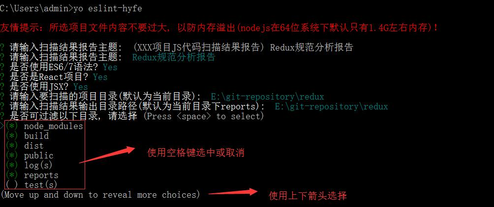
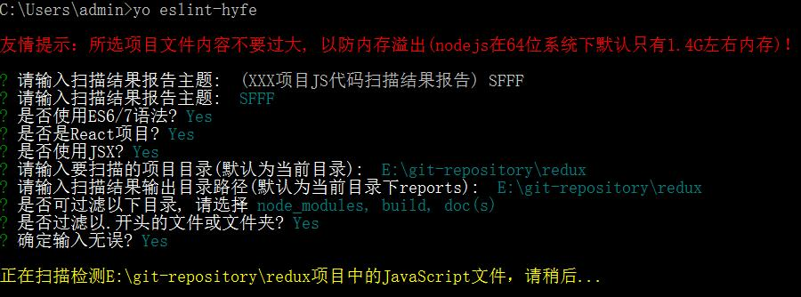
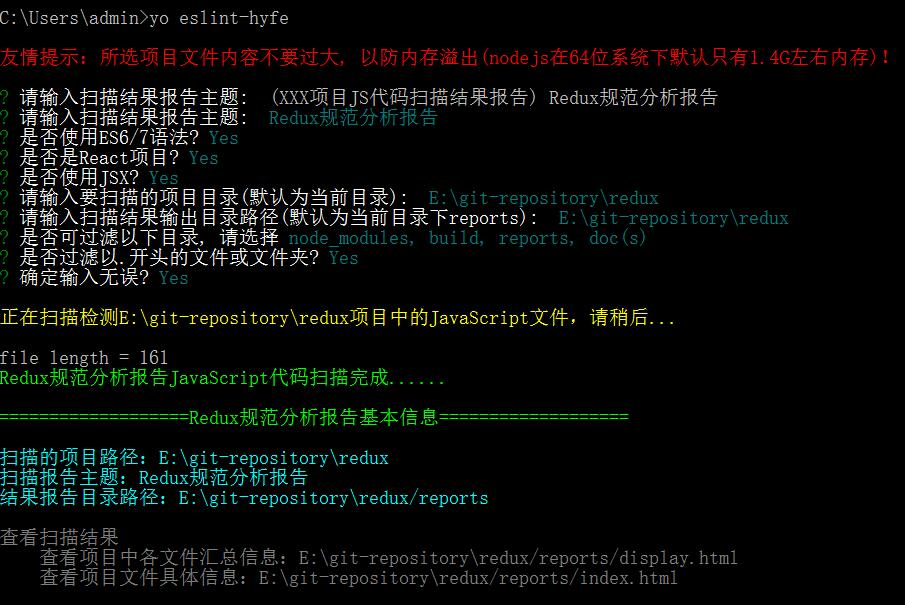

# generator-eslint-hyfe
前端项目JavaScript可视化分析报告生成器，基于eslint对JS文件进行检测。

## Getting Started
### Installation
```
$ npm install -g yo
$ npm install -g generator-eslint-hyfe
```

### Usage
```
$ yo eslint-hyfe
```

执行yo hyfe指令后，根据提示输入或选择相应的参数内容，如下图所示：



确认信息无误后，输入y，开始对项目中的JS文件进行分析检测，如下图所示：



创建成功后，控制台显示具体的信息，如下图所示：



### 更新记录

#### V0.0.1
- 首次发布


